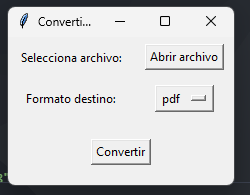

# 🔄 Convertidor de Archivos - GUI (DOCX / PDF / TXT / MD)

Herramienta **interactiva con interfaz gráfica** en Python para convertir entre formatos de texto: `.docx`, `.pdf`, `.txt`, `.md`.

## ✅ Características
- Interfaz gráfica simple y clara (Tkinter)
- Conversión entre formatos comunes: DOCX, PDF, TXT, MD
- Fallback inteligente si no hay Pandoc
- Ideal para uso personal 

## ⚙️ Requisitos
```bash
pip install -r requirements.txt



